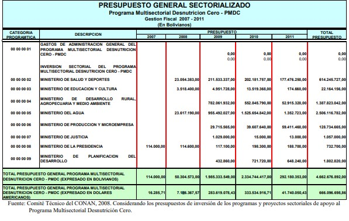

<h2> Estado del Arte </h2>

a)	En Chile fue implementado un Laboratorio de Micronutrientes para obtener leche fortificada con hierro, eficaz para prevenir la ferropenia en lactantes y preescolares. El Laboratorio de Micronutrientes esta formado por 4 laboratorios: Laboratorio de Micro minerales y Vitaminas, Laboratorio de Flúor, Laboratorio de Antioxidantes, Laboratorio de Enfermedad Celiaca. El enriquecimiento de los alimentos es uno de los métodos para prevenir la carencia de hierro en la población. Su principal ventaja es que el consumo de tales alimentos no requiere una conducta activa por parte del sujeto; la leche y los cereales son los alimentos enriquecidos más utilizados en lactantes (Walter et al., 1993, 1998 y 1990). En 1974-1975, en el único estudio realizado en Chile de una muestra representativa nacional, la prevalencia de la anemia en niños menores de 2 años fue del 20 por ciento (Ríos et al., 1983). Estudios posteriores llevados a cabo con muestras no representativas mostraron una prevalencia de la anemia similar (Olivares et al., 2000). El Programa Nacional de Alimentación Complementaria (PNAC), administrado por el Ministerio de Salud, proporciona gratuitamente 2 kg de leche en polvo entera al mes a los lactantes menores de 2 años (actualmente solo a los menores de 18 meses) y 1 kg al mes a las mujeres embarazadas. El programa cubre aproximadamente el 70 por ciento de los lactantes del país. Se estudió la posibilidad de enriquecer la leche semidescremada (12 por ciento materias grasas) en polvo. El PNAC suministra este producto con un contenido de 15 mg de Fe en forma de sulfato ferroso por 100 g de leche en polvo. Dos kilos de leche suministrados mensualmente aportan una ingesta diaria promedio de 10 mg de hierro.  La eficacia de esta leche se probó durante un periodo de estudio de terreno de lactantes cuyo peso al nacimiento era superior a los 2 500 g y que habían sido destetados espontáneamente antes de los 3 meses de edad. Doscientos setenta y ocho niños recibieron leche enriquecida a partir de los 3 meses, y 232 niños recibieron leche sin enriquecer suministrada por el PNAC. Se observó que después de 12 meses la prevalencia de anemia fue del 7 por ciento en el grupo de niños que había consumido constantemente leche enriquecida, y del 35,3 por ciento en el grupo de control, que había consumido leche no enriquecida. Aunque el enriquecimiento de la leche se asoció a un mejoramiento del estado de nutrición férrica, no se consiguió erradicar la anemia; el PNAC sustituyo la leche semidescremada por leche entera (con 26 % de materia grasa). Aunque se demostró que la leche enriquecida con hierro y ácido ascórbico erradicaba la anemia ferropénica, esta leche no fue introducida en el PNAC debido a su mayor costo (+10 a 15 por ciento) en razón del tiempo extra requerido para el proceso de acidificación, la necesidad de utilizar envases de hojalata sellados al vacío, y la falta de decisión política de las autoridades. A pesar de que el costo del enriquecimiento era modesto, los fondos disponibles fueron utilizados para atender problemas de salud más urgentes. Los economistas no estaban convencidos de la relación costo-beneficio positiva del control de la ferropenia, ya que muchos de sus efectos deletéreos no son fácilmente evaluables desde un punto de vista económico. Otra barrera era el desconocimiento de algunos profesionales de la salud, planificadores y autoridades gubernamentales de los efectos adversos de la carencia de hierro; años más tarde se produjo una leche en polvo completa enriquecida con 10 mg de Fe (en forma de sulfato ferroso), 70 mg de ácido ascórbico, 5 mg de Zn y 0,5 mg de Cu por 100 g. Esta leche fue almacenada en bolsas trilaminadas con un barrido de nitrógeno. La biodisponibilidad de hierro de esta leche fue del 12 por ciento;  la leche no enriquecida del PNAC fue reemplazada por esta leche. Los resultados preliminares de la eficacia de esta intervención han puesto de manifiesto una reducción del 66 por ciento de la prevalencia de la anemia de los lactantes( http://www.fao.org/tempref/docrep/fao/005/y8346m/y8346m08.pdf )

b)	En Bolivia la prevalencia de anemia se mantiene elevada a pesar de la existencia de programas de alimentación como el Programa Multisectorial Desnutrición Cero, ejecutado por el Consejo Nacional de Alimentación y Nutrición. El objetivo general de este programa es erradicar la desnutrición en menores de cinco con énfasis en menores de dos años mediante acciones multisectoriales, y uno de sus objetivos específicos es mejorar hábitos de alimentación y consumo, y prácticas de cuidado de la salud de niños y niñas menores de 5 años, mujeres embarazadas y en periodo de lactancia.

 

  
 

c)En Colombia, el Ministerio de Salud y la Protección Social y el Instituto Nacional de Salud, con el apoyo del Programa Mundial de Alimentos, diseñaron el Programa de Prevención y Reducción de Anemia Nutricional en niños de 6 a 23 meses.

d)En Argentina, el Ministerio de Salud ha establecido los Lineamientos de Prevención y Tratamiento de la Anemia en la Población Materno Infantil mediante acciones estratégicas a corto plazo (suplementación, ligadura oportuna del cordón umbilical, lactancia materna), mediano plazo (fortificación de alimentos) y largo plazo (educación alimentaria nutricional, desparasitación, saneamiento ambiental, educación comunitaria).

e) En Brasil, el Ministerio de Salud ha establecido un Programa Nacional de Suplementación de Hierro para reducir la anemia por deficiencia de hierro en niños de 6 a 18 meses, mujeres embarazadas y en postparto.

