<h1> Estado del Arte </h1>
<h2>Estado del Arte del Grupo Objetivo (Niños en el Perú): Tecnológico (Productos y Servicios) y Temático</h2>

<h4>Forticao</h4>

Es una marca, que desarrolla productos con evidencia científica gestionando el financiamiento en entidades como USAID, BID (Innovate Perú) y asistencia técnica de expertos entre ellos la Universidad Peruana Cayetano Heredia-UPCH.

Es una marca, que le agrega valor al grano de CACAO, transformándolo en productos para el mercado farmacéutico, estos son:

- Forticao polvo (cocoa fortificada con hierro heminico)

- Forticao Chocolate (chocolate de leche fortificado con hierro hemínico)

Ambas presentaciones son ALIMENTOS FORTIFICADOS, siendo esta estrategia recomendada por la Organización Mundial de la Salud-OMS, para luchar contra la anemia nutricional y la desnutrición.

 

  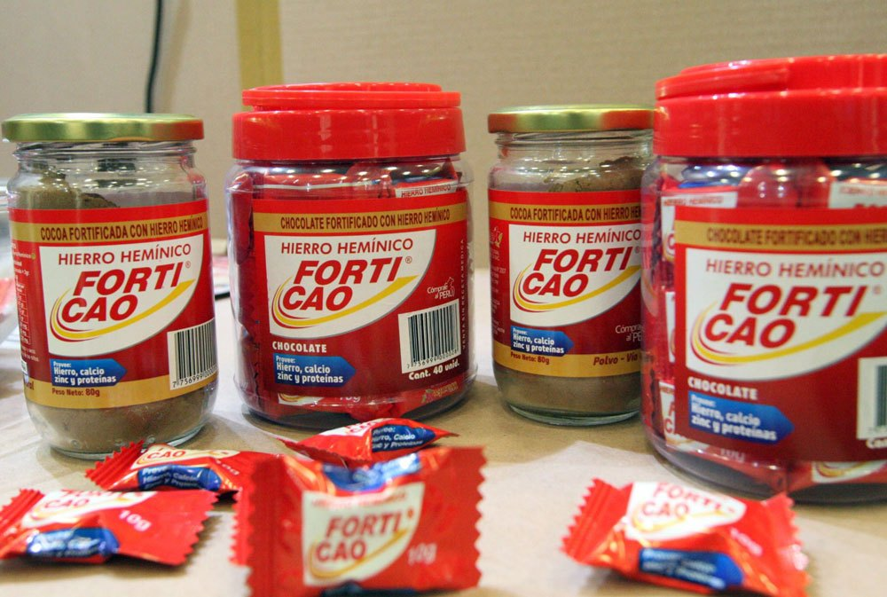
 

<h4>Iron Fish</h4>

El Lucky Iron Fish es una pequeña herramienta de cocina de hierro que infunde a tus comidas una cantidad saludable de hierro natural para ayudar a prevenir la deficiencia de hierro y la anemia. Es fácil de usar y proporciona una fuente natural de hierro que es perfecta para todos, especialmente para aquellos con una mayor necesidad de hierro.

 

  
 

<h4>Arroz Fortificado</h4>

El arroz representa un vehículo efectivo mejorar el consumo de hierro, especialmente en las mujeres en edad fértil y la población infantil, sin alterar los hábitos de alimentación. Esta estrategia ya se implementó en países como Costa Rica, India y México.

La fórmula de arroz fortificado ha sido elaborada por el Centro Nacional de Alimentación y Nutrición (Cenan), del Instituto Nacional de Salud (INS), y contiene diez micronutrientes (vitamina A, B1, B3, B6, B12, D, E, ácido fólico, hierro y zinc).

DATO: El arroz es el cereal que más se consume en el Perú, estimándose un aproximado de 140 gramos en los adultos y 36 gramos en niños de 12 a 36 meses de edad.

 

  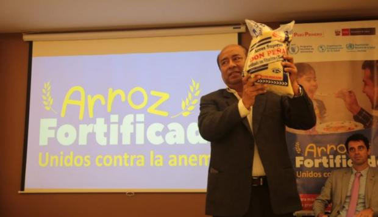
 

<h4>Harinas Fortificadas con Hierro</h4>

Desde el 2006, en el Perú es obligatoria la fortificación de la harina de trigo con micronutrientes como el hierro. La Organización Mundial de la Salud (OMS) considera que la fortificación de los alimentos es una intervención de salud pública efectiva que conduce a una mejora rápida del estado nutricional de las personas.

 

  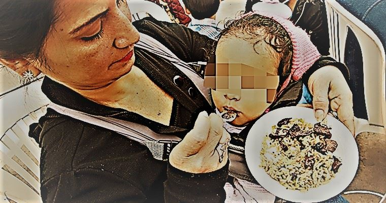
 

<h4>Prevención</h4>

La Endes 2014, revela que en 6 regiones del sur existen más de 230 mil niños con anemia y desnutrición. Para combatir estos males el Estado entrega, a través de los centros de salud, multimicronutrientes o Chispitas.Madres pueden prevenir la anemia y desnutrición en sus hijos, dándoles a diario un sobre de "chispitas".

 

  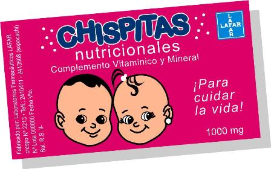
 

<h4>Aplicativo Móvil</h4>

El Ministerio de Salud lanzó el aplicativo móvil “App de Lucha y Movilización contra la Anemia (ALMA)” para brindar a los padres de familia información personalizada sobre cada uno de sus hijos menores de 36 meses a fin de prevenir y controlar esta enfermedad.

“Esta aplicación móvil permitirá a los padres de familia hacer el seguimiento de las fechas clave para el control de crecimiento de sus hijos, práctica de la lactancia materna, el control de vacunas, el inicio de consumo de gotitas de hierro, el descarte de anemia, el inicio de las comidas, entrega de micronutrientes, así como el tratamiento y control de la anemia y fechas de sus controles de hemoglobina”, manifestó la ministra de Salud, Silvia Pessah.

 

  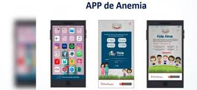
 

<h4>Padron nominal</h4>

Acciones para terminar con la desnutrición y anemia infantil”. Abordará la importancia del Padrón Nominal, como instrumento de monitoreo de la situación de la primera infancia y poder controlar y reducir la anemia infantil.

 

  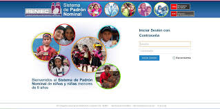
 

<h4>Punto de corte</h4>

Según la OMS niños por debajo de 11g/dL ; sin embargo esta evaluación se hizo en 1988, tuvo que haber sido revisada en el 2012 pero hasta el día de hoy no se ha evaluado.

 

  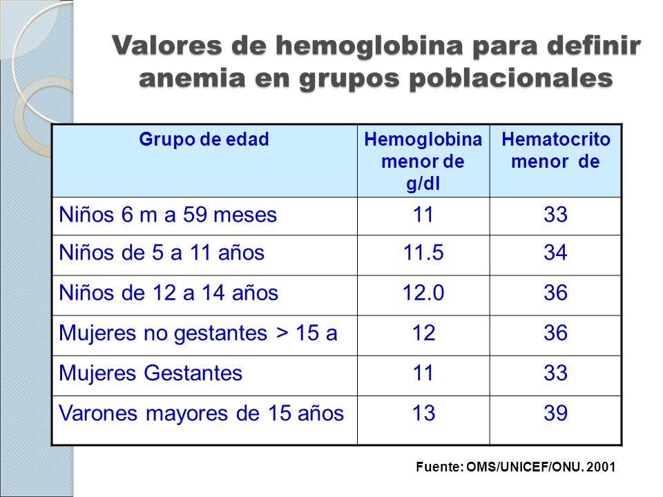
 

<h4>El 50% de Anemias son Ferropenicas</h4>

Este es un dato proporcionado por la OMS ,que no necesariamente aplica en el Perú, no existe estudios que nos indique en que porcentaje es ferropenica, ni tampoco de que tipo: leve ,moderada o severa.

 

  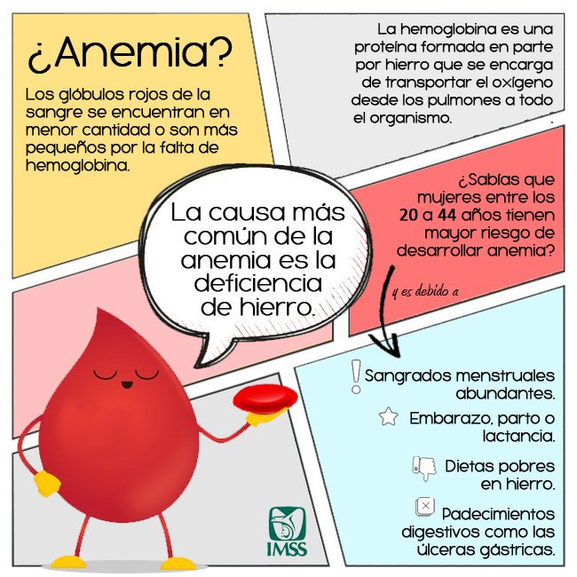
 

<h4>Hepcidina</h4>

Un estudio hecho en el 2007 revelo que la absorción del hierro en el duodeno esta controlado por la hepcidina, el cual puede evitar su ingreso a la sangre por diversos motivos, lo que trae como consecuencia diagnostico de anemia.

 

  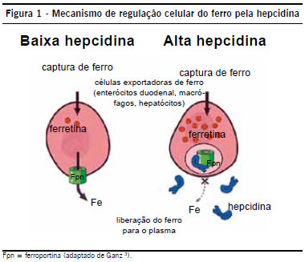
 

<h4>Documento Técnico Reducción de la Anemia</h4>

Hecho el 2017 nos indica la serie de protocolos con respecto a la anemia: diagnostico y tratamiento. Ademas de todos los detalles especializados a tener en cuenta.

 

  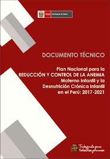
 

<h4>Plan Multisectorial Midis Lucha Contra la Anemia</h4>

Plan firmado por 17 ministerios partiendo de la base que la anemia es un problema multisectorial.

 

  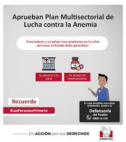
 

<h4>Jarabe Sulfato Ferroso</h4>

Forma del mineral hierro que se usa para tratar la anemia que resulta de tener concentraciones bajas de hierro en la sangre. La anemia es una afección en la que el número de glóbulos rojos es bajo. El sulfato ferroso es un tipo de antianémico y de suplemento alimentario.

 

  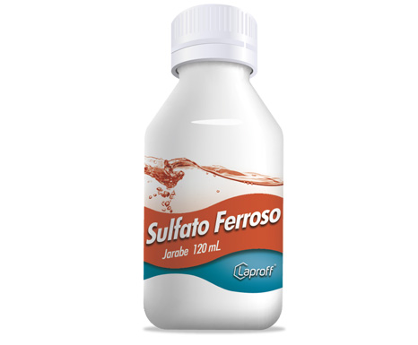
 

<h4>Sulfato Ferroso en Gotas</h4>

Tiene los mismos alcances que el jarabe solo que esta destinado a los niños de 4 a 6 meses de edad.

 

  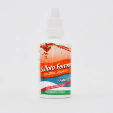
 

<h3> Por paises: </h3>

a)	En Chile fue implementado un Laboratorio de Micronutrientes para obtener leche fortificada con hierro, eficaz para prevenir la ferropenia en lactantes y preescolares. El Laboratorio de Micronutrientes esta formado por 4 laboratorios: Laboratorio de Micro minerales y Vitaminas, Laboratorio de Flúor, Laboratorio de Antioxidantes, Laboratorio de Enfermedad Celiaca. El enriquecimiento de los alimentos es uno de los métodos para prevenir la carencia de hierro en la población. Su principal ventaja es que el consumo de tales alimentos no requiere una conducta activa por parte del sujeto; la leche y los cereales son los alimentos enriquecidos más utilizados en lactantes (Walter et al., 1993, 1998 y 1990). En 1974-1975, en el único estudio realizado en Chile de una muestra representativa nacional, la prevalencia de la anemia en niños menores de 2 años fue del 20 por ciento (Ríos et al., 1983). Estudios posteriores llevados a cabo con muestras no representativas mostraron una prevalencia de la anemia similar (Olivares et al., 2000). El Programa Nacional de Alimentación Complementaria (PNAC), administrado por el Ministerio de Salud, proporciona gratuitamente 2 kg de leche en polvo entera al mes a los lactantes menores de 2 años (actualmente solo a los menores de 18 meses) y 1 kg al mes a las mujeres embarazadas. El programa cubre aproximadamente el 70 por ciento de los lactantes del país. Se estudió la posibilidad de enriquecer la leche semidescremada (12 por ciento materias grasas) en polvo. El PNAC suministra este producto con un contenido de 15 mg de Fe en forma de sulfato ferroso por 100 g de leche en polvo. Dos kilos de leche suministrados mensualmente aportan una ingesta diaria promedio de 10 mg de hierro.  La eficacia de esta leche se probó durante un periodo de estudio de terreno de lactantes cuyo peso al nacimiento era superior a los 2 500 g y que habían sido destetados espontáneamente antes de los 3 meses de edad. Doscientos setenta y ocho niños recibieron leche enriquecida a partir de los 3 meses, y 232 niños recibieron leche sin enriquecer suministrada por el PNAC. Se observó que después de 12 meses la prevalencia de anemia fue del 7 por ciento en el grupo de niños que había consumido constantemente leche enriquecida, y del 35,3 por ciento en el grupo de control, que había consumido leche no enriquecida. Aunque el enriquecimiento de la leche se asoció a un mejoramiento del estado de nutrición férrica, no se consiguió erradicar la anemia; el PNAC sustituyo la leche semidescremada por leche entera (con 26 % de materia grasa). Aunque se demostró que la leche enriquecida con hierro y ácido ascórbico erradicaba la anemia ferropénica, esta leche no fue introducida en el PNAC debido a su mayor costo (+10 a 15 por ciento) en razón del tiempo extra requerido para el proceso de acidificación, la necesidad de utilizar envases de hojalata sellados al vacío, y la falta de decisión política de las autoridades. A pesar de que el costo del enriquecimiento era modesto, los fondos disponibles fueron utilizados para atender problemas de salud más urgentes. Los economistas no estaban convencidos de la relación costo-beneficio positiva del control de la ferropenia, ya que muchos de sus efectos deletéreos no son fácilmente evaluables desde un punto de vista económico. Otra barrera era el desconocimiento de algunos profesionales de la salud, planificadores y autoridades gubernamentales de los efectos adversos de la carencia de hierro; años más tarde se produjo una leche en polvo completa enriquecida con 10 mg de Fe (en forma de sulfato ferroso), 70 mg de ácido ascórbico, 5 mg de Zn y 0,5 mg de Cu por 100 g. Esta leche fue almacenada en bolsas trilaminadas con un barrido de nitrógeno. La biodisponibilidad de hierro de esta leche fue del 12 por ciento;  la leche no enriquecida del PNAC fue reemplazada por esta leche. Los resultados preliminares de la eficacia de esta intervención han puesto de manifiesto una reducción del 66 por ciento de la prevalencia de la anemia de los lactantes( http://www.fao.org/tempref/docrep/fao/005/y8346m/y8346m08.pdf )

 b)	En Bolivia la prevalencia de anemia se mantiene elevada a pesar de la existencia de programas de alimentación como el Programa Multisectorial Desnutrición Cero, ejecutado por el Consejo Nacional de Alimentación y Nutrición. El objetivo general de este programa es erradicar la desnutrición en menores de cinco con énfasis en menores de dos años mediante acciones multisectoriales, y uno de sus objetivos específicos es mejorar hábitos de alimentación y consumo, y prácticas de cuidado de la salud de niños y niñas menores de 5 años, mujeres embarazadas y en periodo de lactancia.

 

  
 

 c)En Colombia, el Ministerio de Salud y la Protección Social y el Instituto Nacional de Salud, con el apoyo del Programa Mundial de Alimentos, diseñaron el Programa de Prevención y Reducción de Anemia Nutricional en niños de 6 a 23 meses.

 d)En Argentina, el Ministerio de Salud ha establecido los Lineamientos de Prevención y Tratamiento de la Anemia en la Población Materno Infantil mediante acciones estratégicas a corto plazo (suplementación, ligadura oportuna del cordón umbilical, lactancia materna), mediano plazo (fortificación de alimentos) y largo plazo (educación alimentaria nutricional, desparasitación, saneamiento ambiental, educación comunitaria).

 e) En Brasil, el Ministerio de Salud ha establecido un Programa Nacional de Suplementación de Hierro para reducir la anemia por deficiencia de hierro en niños de 6 a 18 meses, mujeres embarazadas y en postparto.

Un aplicativo al que denominaron Hacknemia, permite a los profesionales de la salud ingresar a tres datos con los cuales evalúan a los niños para así conocer si padecen de anemia. Con información sobre el peso, la edad y el nivel de hemoglobina de la sangre, el aplicativo realiza una lectura, permite emitir un resultado y la dosificación del tratamiento en caso de detectarse la anemia.

En el Perú, este aplicativo podría utilizarse en 7 mil establecimientos de salud y beneficiar a 150 mil médicos, enfermeras y nutricionistas en su trabajo de la lucha contra la anemia. Este aplicativo también podría utilizarse en continentes como África y Asia, ya que la información que tomaron al momento de desarrollar la herramienta, utilizó como datos los de la Organización Mundial de la Salud.

 

  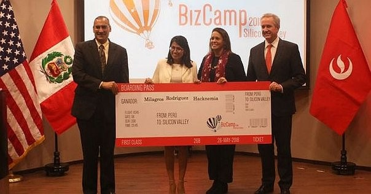
 

 
<h2>ETIOLOGÍA DE LA ANEMIA FERROPÉNICA </h2>

  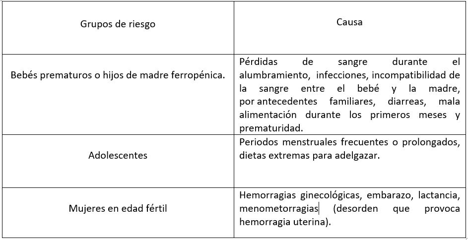
 

<h2>JUSTIFICACIÓN DE LAS CAUSAS (NIÑOS)</h2>
<h4>-	Un desconocimiento, por parte de los adultos a cargo de niños, respecto a la correcta alimentación que se debe seguir.</h4>

Esto se evidencia en el 2017 donde la Organización de las Naciones Unidas para la Alimentación y la Agricultura (FAO) muestra que cerca de 2 millones de personas padecen de hambre y el 36,9% de los peruanos mayores de 15 años sufre de sobrepeso. Para el año 2018 la obesidad y el sobrepeso afecta al 57.9% de peruanos mayores de 15 años, de acuerdo a la Encuesta Demográfica y de Salud Familiar (Endes) del Instituto Nacional de Estadística e Informática (INEI).

Para relacionarlo con la anemia, la ministra de Salud, Midori de Habich en el 2013, dijo que los malos hábitos alimenticios causarían una tendencia creciente en los niveles de anemia en las zonas urbanas del país; a diferencia de las áreas rurales y, finalmente, un estudio de tesis titulado “Prácticas de alimentación y su relación con la anemia ferropénica en niños de 6 a 24 meses puente piedra, 2016” de Alvarez Quiñones, Gaby Consuelo, Huamani Mendoza, Elisa y Montoya Jiménez, Clara Trinidad estudiantes de la Universidad Peruana Cayetano Heredia llego a la conclusión de que se encontró que se puede aumentar o disminuir el índice de anemia ferropénica en niños debido a la frecuencia inadecuada de alimentos al día, dar de lactar en el momento inadecuado y el consumo de comida chatarra.

<h4>-	Parasitosis y diarreas.</h4>

La parasitosis es causada por diferentes tipos de parásitos, afecta principalmente a los niños de 1 a 5 años. Son transmitidos por medio de alimentos y aguas contaminadas. Causa diarreas, sangrado intestinal, pérdida del apetito, pérdida de peso, desnutrición y anemia. [*] 

En el Perú, el 50% de niños en nuestro país durante el 2017 sufren de parasitosis, sobre todo en la selva, según el secretario del Colegio Médico del Perú, Raúl Urquizo Aréstegui. 

<h5>PERÚ: EVOLUCIÓN DE VIVIENDAS CON FUENTE DE AGUA PARA BEBER POR RED PÚBLICA 1/, SEGÚN ÁREA DE RESIDENCIA, 1991-1992, 1996, 2000, 2004-2006, 2007-2008, 2009-2017 (Porcentaje).</h5>

  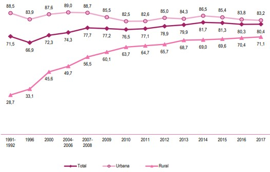
 

 
<h4>-	Regulación de la hepcidina. </h4> 

La regulación del hierro depende de la hepcidina, pequeña hormona peptídica que se produce fundamentalmente por los hepatocitos en respuesta a la cantidad de hierro circulante, ya que cuando la concentración de la hepcidina aumenta la absorción del hierro disminuye. 
La hepcidina puede aumentar por las infecciones respiratorias agudas (IRA). La prevalencia de las IRA en el Perú, en niños, por edades es de 6 a 11 meses (17,4%) y de 12 a 23 meses (17,1%). El porcentaje de niñas y niños en las dos semanas precedentes a la Encuesta fue 14,6% en el 2017.

<h5>PERÚ: PREVALENCIA Y TRATAMIENTO DE INFECCIONES RESPIRATORIAS AGUDAS (IRA) EN NIÑAS Y NIÑOS MENORES DE CINCO AÑOS DE EDAD, SEGÚN EDAD EN MESES, 2017 (Porcentaje)</h5>

  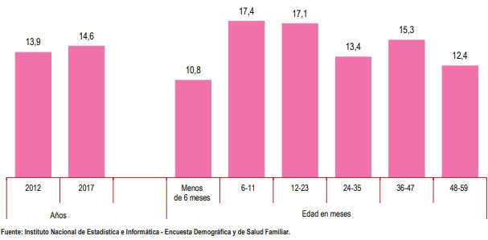
 

 
<h4>-	Prematuridad </h4>

Después de que un niño nace prematuro existe una mayor necesidad de aporte férrico como consecuencia de la falta de depósitos y del aumento de necesidades por la tasa de crecimiento, y cuando esto coincide con un aporte insuficiente de hierro en la dieta se llega a producir anemia ferropénica.

<h5>Porcentaje de partos en el Perú (meses)</h5> 
 

  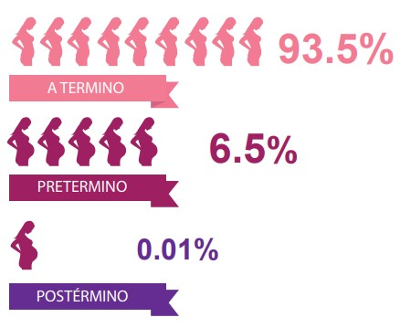
 

 

PRETÉRMINO: concepción antes de las 37 semanas de gestación, mientras que los nacidos A TÉRMINO son los que nacieron entre las 37 y 42 semanas de gestación y los POSTÉRMINO, aquellos que nacieron después de las 42 semanas de gestación. 
Se considera parto prematuro cuando el número de semanas de gestación es menor de 37.

<h4>MINSA, Perú 2015, “BOLETÍN ESTADÍSTICO DE NACIMIENTOS PERÚ (REGISTRADOS EN LÍNEA)”</h4>

-	Mala absorción del hierro.

Debido a diversas enfermedades como la enfermedad celíaca, enfermedad de Crohn. 

-	Hemorragias internas

Cefalohematoma, hemorragia suprarrenal, HIV, subgaleal.

- Accidentes obstétricos

Rotura del cordón, DPPNI, incisiones en placenta o cordón.

